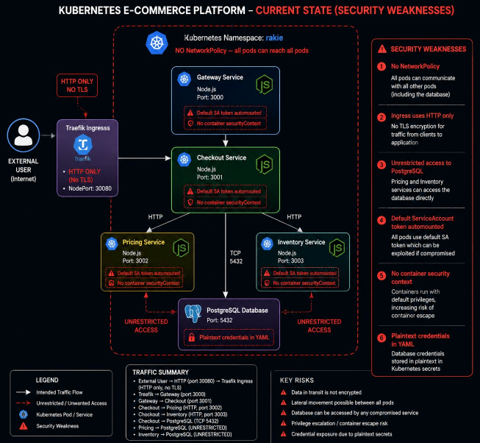

# 🔐 Rakie K3s — Security Hardening, Observability & Controlled Testing

> **Enterprise Architecture Design — CA2**
> TU Dublin · MSc DevOps 2025/2026 · Rakesh Uday Kumar (A00047386)
> Platform: K3s v1.34.6 · Ubuntu 24 LTS · VirtualBox
> Namespace: `rakie` · 5 Node.js microservices + PostgreSQL
> CA1 repo: [rakie-k3s_E-commerce](https://github.com/Rakeshu99/rakie-k3s_E-commerce)
> CA2 report: [rakie-k3s-security2](https://github.com/Rakeshu99/rakie-k3s-security2)

---

## CA1 → CA2 Progression

CA1 built the platform. CA2 secures, monitors, and validates it.

| CA1 Delivered | CA2 Added |
|---|---|
| 5 microservices on K3s | 6 security weaknesses identified + prioritised by CVSS |
| Traefik ingress NodePort 30080 | NetworkPolicy: flat trust zone → least-privilege |
| KEDA HTTP autoscaling (cron trigger corrected) | securityContext hardened on all 4 app pods |
| PostgreSQL with PVC | SA token disabled on all 4 deployments |
| Basic health endpoints | Credentials: plaintext stringData → base64 imperative |
| | CVE-2026-31789 OpenSSL CRITICAL → fixed (CRITICAL: 0) |
| | CVE-2026-42033 axios HIGH → fixed (axios 1.15.2) |
| | Structured JSON logging + X-Request-Id on all 4 services |
| | Prometheus + Grafana: 13 ServiceMonitors, 35 PrometheusRules |
| | 3-state failure scenario: root cause in under 60 seconds |
| | Container penetration tests CT-1 through CT-7 |

---

## Architecture — Current State (Before Hardening)


```
                    ┌─────────────────────────────────────────────┐
                    │  K3s CLUSTER — namespace: rakie              │
                    │  NO NetworkPolicy — flat trust zone          │
 External User ───► │                                              │
    (HTTP)          │  Traefik (HTTP only, NodePort 30080)         │
                    │       ▼                                      │
                    │  Gateway (port 3000)                         │
                    │  ⚠ default SA token  ⚠ no securityContext   │
                    │       ▼                                      │
                    │  Checkout (port 3001)                        │
                    │  ⚠ hardcoded DB pwd  ⚠ no securityContext   │
                    │    ▼           ▼           ▼                 │
                    │  Pricing    Inventory   PostgreSQL           │
                    │  (3002)     (3003)      (5432)               │
                    │  ⚠ any pod can reach postgres directly       │
                    │  ⚠ plaintext POSTGRES_PASSWORD in YAML       │
                    └─────────────────────────────────────────────┘

Security weaknesses:
  1. No NetworkPolicy — CVSS 9.8 CRITICAL
  2. Plaintext credentials in secret.yaml — CVSS 7.5
  3. No securityContext on any pod — CVSS 7.8
  4. Default SA token automounted — CVSS 7.5
  5. CVE-2026-31789 OpenSSL (CRITICAL) + CVE-2026-42033 axios (HIGH) in all images
  6. HTTP-only Traefik ingress — CVSS 5.9
```

---

## Architecture — Improved State (After Hardening)

```
                    ┌─────────────────────────────────────────────────────────┐
                    │  K3s CLUSTER — namespace: rakie                          │
                    │  NetworkPolicy: default-deny-all + 5 scoped allow rules  │
                    │  6 controls APPLIED                                       │
 External User ───► │                                                          │
    (HTTP)     P7►  │  Traefik (HTTP, NodePort 30080) [TLS: Recommended]       │
               TLS  │       │ ALLOWED                                          │
  recommended       │       ▼                                                  │
                    │  Gateway (port 3000)           ──✗──► Kubernetes API     │
                    │  ✓ securityContext hardened         BLOCKED (SA disabled) │
                    │  ✓ SA token: false                                        │
                    │  ✓ :hardened image                                        │
                    │       │ ALLOWED                                           │
                    │       ▼                                                   │
                    │  Checkout (port 3001)                                     │
                    │  ✓ securityContext hardened                               │
                    │  ✓ SA token: false                                        │
                    │  ✓ :hardened image (axios 1.15.2)                        │
                    │    │ ALLOWED  │ ALLOWED    │ ALLOWED                      │
                    │    ▼          ▼            ▼                              │
                    │  Pricing    Inventory   PostgreSQL (5432)                 │
                    │  ✓ hardened ✓ hardened  ✓ base64 credentials             │
                    │    │                    ✓ checkout access only            │
                    │    └──✗──────────────►  BLOCKED (NetworkPolicy)          │
                    │         pricing/inventory → postgres: DENIED              │
                    └─────────────────────────────────────────────────────────┘
                    ┌──────────────────────────────────┐
                    │ namespace: monitoring              │
                    │ Prometheus ──► Grafana (:32000)   │
                    │ 13 ServiceMonitors                │
                    │ 35 PrometheusRules                │
                    └──────────────────────────────────┘

Controls APPLIED (P1-P6):
  ✅ P1 — NetworkPolicy: default-deny-all + 5 scoped allow rules
  ✅ P2 — CVE-2026-31789 OpenSSL CRITICAL: fixed (apk upgrade → CRITICAL: 0)
  ✅ P3 — CVE-2026-42033 axios HIGH: fixed (npm install axios@1.15.2)
  ✅ P4 — securityContext: allowPrivEsc:false, drop:ALL, readOnlyFS:true
  ✅ P5 — automountServiceAccountToken: false on all 4 app pods
  ✅ P6 — Credentials: base64 data field, imperative creation, no plaintext

Recommended (P7):
  📋 P7 — TLS via cert-manager on Traefik ingress (HTTP only — unencrypted)
```

---

## Security Findings — P1 through P8

| P# | Finding | CVSS | Status | Report Evidence |
|---|---|---|---|---|
| P1 | No NetworkPolicy — flat trust zone, any pod reaches postgres | 9.8 | ✅ APPLIED | FX-1, CT-6, CT-7 |
| P2 | CVE-2026-31789 OpenSSL heap overflow — all 4 images | 9.8 | ✅ APPLIED | T2, CVE-1 to CVE-6 |
| P3 | CVE-2026-42033 axios prototype pollution — gateway + checkout | 8.1 | ✅ APPLIED | T3, CVE-5, CVE-6 |
| P4 | allowPrivilegeEscalation:true on all workloads | 7.8 | ✅ APPLIED | FX-2, FX-3 |
| P5 | readOnlyRootFilesystem:false + SA token automounted | 5.5/7.5 | ✅ APPLIED | SA-1 to SA-4 |
| P6 | Plaintext POSTGRES_PASSWORD in secret.yaml stringData | 7.5 | ✅ APPLIED | SEC-1 to SEC-5 |
| P7 | HTTP-only Traefik ingress — no TLS | 5.9 | 📋 Recommended | — |
| P8 | — | — | — | — |

---

## All Commands Used (CA2 Brief Requirement)

> Every command below was executed on `eaduser@EADCA1VM` and evidenced
> with terminal screenshots in the CA2 report. Commands are listed in the
> same order they appear in the report.

---

### PART 1 — Cluster State Verification

```bash
# Confirm K3s node ready
kubectl get nodes -o wide

# Full resource inventory — Figure 1, Figure 2
kubectl get pods -n rakie
kubectl get all -n rakie

# Confirm no NetworkPolicy before fix — Figure 3
kubectl get networkpolicies -n rakie

# Show plaintext credentials — Figure 4
cat /home/eaduser/rakie/k8s/secrets/postgres-secret.yaml

# Show default SA only — Figure 5
kubectl get serviceaccounts -n rakie

# Show HTTP-only ingress — Figure 6
kubectl get ingress -n rakie -o yaml
```

---

### PART 1 — P1 Fix: NetworkPolicy (CVSS 9.8 CRITICAL)

```bash
# Apply default-deny-all — blocks ALL ingress/egress in rakie namespace
kubectl apply -f k8s/networkpolicy/00-default-deny-all.yaml

# Apply 5 scoped allow rules (minimum required paths only)
kubectl apply -f k8s/networkpolicy/01-allow-rules.yaml

# Verify 6 NetworkPolicy objects created — Figure FX-1
kubectl get networkpolicies -n rakie

# Verify NetworkPolicy objects with detail
kubectl describe networkpolicy -n rakie
```

---

### PART 1 — P4/P5 Fix: SecurityContext Hardening (CVSS 7.8/5.5)

```bash
# Apply hardened securityContext to all 4 app deployments — Figure FX-2
kubectl apply -f k8s/securitycontext/all-deployments.yaml

# Verify patch applied on gateway — Figure FX-3
kubectl get deployment gateway -n rakie \
  -o jsonpath='{.spec.template.spec.containers[0].securityContext}'

# Confirm all pods restarted and running
kubectl get pods -n rakie

# Full deployment YAML confirmation
kubectl get deployment gateway -n rakie -o yaml | grep -A 15 securityContext
```

---

### PART 1 — P5 Fix: SA Token Hardening (CVSS 7.5)

```bash
# Check state BEFORE — blank defaults to true — Figure SA-1
kubectl get deployment gateway checkout pricing inventory \
  -n rakie \
  -o jsonpath='{range .items[*]}{.metadata.name}{": "}{.spec.template.spec.automountServiceAccountToken}{"\n"}{end}'

# Patch all 4 app deployments — Figure SA-2
for svc in gateway checkout pricing inventory; do
  kubectl patch deployment $svc -n rakie \
    --type='json' \
    -p='[{"op":"add","path":"/spec/template/spec/automountServiceAccountToken","value":false}]'
  echo "$svc patched"
done

# Verify false on all 4 — Figure SA-3
kubectl get deployment gateway checkout pricing inventory \
  -n rakie \
  -o jsonpath='{range .items[*]}{.metadata.name}{": automountServiceAccountToken="}{.spec.template.spec.automountServiceAccountToken}{"\n"}{end}'

# Confirm all 5 pods still Running — Figure SA-4
kubectl get pods -n rakie
```

---

### PART 1 — P6 Fix: Credentials Hardening (CVSS 7.5)

```bash
# Delete the insecure secret (had plaintext stringData)
kubectl delete secret postgres-secret -n rakie

# Recreate imperatively — values go to base64 data field
kubectl create secret generic postgres-secret \
  --from-literal=POSTGRES_USER=rakie \
  --from-literal=POSTGRES_PASSWORD="$(openssl rand -base64 16)" \
  --from-literal=POSTGRES_DB=rakie \
  -n rakie

# Verify no plaintext visible — shows byte counts only — Figure SEC-1
kubectl describe secret postgres-secret -n rakie

# Verify base64 data field in YAML — Figure SEC-2
kubectl get secret postgres-secret -n rakie -o yaml

# Confirm all pods still running — Figure SEC-3
kubectl get pods -n rakie

# Verify on live VM — Figure SEC-4
cat /home/eaduser/rakie/k8s/secrets/postgres-secret.yaml

# Confirm system still operational — Figure SEC-5
curl -s -X POST http://localhost:30080/api/checkout \
  -H "Content-Type: application/json" \
  -H "X-Request-Id: ca2-creds-verify" \
  -d '{"sku":"SKU-001","qty":1}'
```

---

### PART 1 — P2/P3 Fix: CVE Remediation (CVSS 9.8 + 8.1)

```bash
# Find all Dockerfiles
find /home/eaduser/rakie -name "Dockerfile" | sort

# View original Dockerfile before fix
cat /home/eaduser/rakie/gateway/Dockerfile

# --- ADD CVE FIXES TO DOCKERFILES ---

# P2: Fix CVE-2026-31789 OpenSSL CRITICAL on ALL 4 images
# Upgrades libcrypto3 from 3.5.5-r0 (vulnerable) to 3.5.6-r0 (fixed)
sed -i '/^FROM/a RUN apk upgrade --no-cache libcrypto3 libssl3' \
  /home/eaduser/rakie/gateway/Dockerfile
sed -i '/^FROM/a RUN apk upgrade --no-cache libcrypto3 libssl3' \
  /home/eaduser/rakie/checkout/Dockerfile
sed -i '/^FROM/a RUN apk upgrade --no-cache libcrypto3 libssl3' \
  /home/eaduser/rakie/pricing/Dockerfile
sed -i '/^FROM/a RUN apk upgrade --no-cache libcrypto3 libssl3' \
  /home/eaduser/rakie/inventory/Dockerfile

# P3: Fix CVE-2026-42033 axios HIGH on gateway + checkout ONLY
# pricing and inventory make no outbound HTTP calls — no axios dependency
sed -i '/npm ci\|npm install/a RUN npm install axios@1.15.2 --save' \
  /home/eaduser/rakie/gateway/Dockerfile
sed -i '/npm ci\|npm install/a RUN npm install axios@1.15.2 --save' \
  /home/eaduser/rakie/checkout/Dockerfile

# Verify all 4 Dockerfiles updated — Figure CVE-1
grep -A1 "^FROM" /home/eaduser/rakie/gateway/Dockerfile
grep -A1 "^FROM" /home/eaduser/rakie/checkout/Dockerfile
grep -A1 "^FROM" /home/eaduser/rakie/pricing/Dockerfile
grep -A1 "^FROM" /home/eaduser/rakie/inventory/Dockerfile

# --- BUILD :hardened IMAGES ---

cd /home/eaduser/rakie

# Build all 4 images — Figure CVE-2: "ALL 4 BUILDS COMPLETE"
docker build -t rakie-gateway:hardened   ./gateway/   && \
docker build -t rakie-checkout:hardened  ./checkout/  && \
docker build -t rakie-pricing:hardened   ./pricing/   && \
docker build -t rakie-inventory:hardened ./inventory/ && \
echo "ALL 4 BUILDS COMPLETE"

# --- IMPORT INTO K3s ---
# K3s does NOT use Docker daemon — must import separately

# Figure CVE-3: "ALL IMAGES IMPORTED"
docker save rakie-gateway:hardened   | sudo k3s ctr images import -
docker save rakie-checkout:hardened  | sudo k3s ctr images import -
docker save rakie-pricing:hardened   | sudo k3s ctr images import -
docker save rakie-inventory:hardened | sudo k3s ctr images import -
echo "ALL IMAGES IMPORTED"

# --- DEPLOY HARDENED IMAGES ---

kubectl set image deployment/gateway   gateway=rakie-gateway:hardened   -n rakie
kubectl set image deployment/checkout  checkout=rakie-checkout:hardened  -n rakie
kubectl set image deployment/pricing   pricing=rakie-pricing:hardened    -n rakie
kubectl set image deployment/inventory inventory=rakie-inventory:hardened -n rakie

# Force rollout restart
kubectl rollout restart deployment/gateway   -n rakie
kubectl rollout restart deployment/checkout  -n rakie
kubectl rollout restart deployment/pricing   -n rakie
kubectl rollout restart deployment/inventory -n rakie

# Confirm all 5 pods Running with :hardened images — Figure CVE-4
kubectl get pods -n rakie
kubectl get pods -n rakie \
  -o jsonpath='{range .items[*]}{.metadata.name}{": "}{.spec.containers[0].image}{"\n"}{end}'
```

---

### PART 2 — Prometheus + Grafana Installation

```bash
# Add Helm repo
helm repo add prometheus-community \
  https://prometheus-community.github.io/helm-charts
helm repo update

# Create isolated monitoring namespace
kubectl create namespace monitoring

# Install kube-prometheus-stack — Figure OB-1
helm install monitoring prometheus-community/kube-prometheus-stack \
  --namespace monitoring \
  --set grafana.service.type=NodePort \
  --set grafana.service.nodePort=32000

# Verify all 6 monitoring pods running
kubectl get pods -n monitoring

# Grafana at http://10.0.2.15:32000 — Figure OB-2, OB-3, OB-4
# Login: admin / prom-operator
```

---

### PART 2 — Structured JSON Logging Verification

```bash
# Send real checkout request and read logs
curl -s -X POST http://localhost:30080/api/checkout \
  -H "Content-Type: application/json" \
  -H "X-Request-Id: ca2-json-final" \
  -d '{"sku":"SKU-001","qty":1}'

# Read structured JSON output — Figure JSON-1
kubectl logs -n rakie deployment/checkout --tail=5
kubectl logs -n rakie deployment/gateway  --tail=5
# Each line: {"timestamp":"...","level":"info","service":"checkout",
#             "requestId":"ca2-json-final","status":200,"durationMs":787}
```

---

### PART 2 — Observability Scenario: Inventory Failure (3 States)

```bash
# ── STATE 1: HEALTHY BASELINE ──────────────────────────────
curl -s -X POST http://localhost:30080/api/checkout \
  -H "Content-Type: application/json" \
  -H "X-Request-Id: ca2-healthy" \
  -d '{"sku":"SKU-001","qty":1}'
# Returns: {"status":"confirmed","orderId":128}

kubectl logs -n rakie deploy/gateway  --tail=3
kubectl logs -n rakie deploy/checkout --tail=5

# ── STATE 2: FAILURE INDUCED ────────────────────────────────
# Scale inventory to 0 replicas — Figure OB-5
kubectl scale deployment inventory --replicas=0 -n rakie
kubectl get pods -n rakie  # inventory shows Terminating

# Send 5 requests — all return 503 — Figure OB-6
for i in $(seq 1 5); do
  curl -s -X POST http://localhost:30080/api/checkout \
    -H "Content-Type: application/json" \
    -H "X-Request-Id: ca2-obs-$i" \
    -d '{"sku":"SKU-001","qty":1}'
done

# 3-STEP DIAGNOSIS using X-Request-Id:
# Step 1: gateway shows 503 — Figure OB-8
kubectl logs -n rakie deploy/gateway | grep "ca2-obs-1"

# Step 2: checkout shows ECONNREFUSED on inventory-svc:3003 — Figure OB-7
kubectl logs -n rakie deploy/checkout | grep "ca2-obs-1"

# Step 3: pod list confirms inventory at 0/0
kubectl get pods -n rakie | grep inventory
# Root cause: inventory pod down — identified in under 60 seconds

# ── STATE 3: RECOVERY ───────────────────────────────────────
# Scale back to 1 — Figure OB-9
kubectl scale deployment inventory --replicas=1 -n rakie
sleep 15 && kubectl get pods -n rakie  # all 5 pods 1/1 Running

# Confirm recovery
curl -s -X POST http://localhost:30080/api/checkout \
  -H "Content-Type: application/json" \
  -H "X-Request-Id: ca2-recover-1" \
  -d '{"sku":"SKU-001","qty":1}'
# Returns: {"status":"confirmed"}
```

---

### PART 3 — Trivy Image Scanning

```bash
# INSTALL Trivy (if not installed)
curl -sSfL https://raw.githubusercontent.com/aquasecurity/trivy/main/contrib/install.sh \
  | sh -s -- -b /usr/local/bin v0.70.0
trivy --version

# BEFORE HARDENING — confirms CRITICAL CVEs present
# Figure T2: gateway OpenSSL CRITICAL CVE-2026-31789
trivy image rakie-gateway:latest \
  --severity CRITICAL,HIGH --no-progress

# Figure T3: gateway axios HIGH CVE-2026-42033
# (same scan output, different section)

# Figure T4: checkout — same CVEs (axios triggered every POST /checkout)
trivy image rakie-checkout:latest \
  --severity CRITICAL,HIGH --no-progress

# Figure T5: inventory — OpenSSL only (no axios)
trivy image rakie-inventory:latest \
  --severity CRITICAL,HIGH --no-progress

trivy image rakie-pricing:latest \
  --severity CRITICAL,HIGH --no-progress

# AFTER HARDENING — Figure CVE-5, CVE-6
# Confirms CRITICAL: 0, alpine 3.23.4: 0, axios: 0
trivy image rakie-gateway:hardened \
  --severity CRITICAL,HIGH --no-progress 2>/dev/null | head -20

trivy image rakie-gateway:hardened \
  --severity CRITICAL,HIGH --no-progress 2>/dev/null | grep "^Total:"

# Scan all 4 after
for img in gateway checkout pricing inventory; do
  echo "=== rakie-$img:hardened ==="
  trivy image rakie-$img:hardened \
    --severity CRITICAL,HIGH --no-progress 2>/dev/null | grep "^Total:"
done
```

---

### PART 3 — kubeaudit Posture Review

```bash
# INSTALL kubeaudit v0.22.2
curl -sSL \
  https://github.com/Shopify/kubeaudit/releases/download/v0.22.2/kubeaudit_linux_amd64.tar.gz \
  | tar xz && sudo mv kubeaudit /usr/local/bin/
kubeaudit version

# BEFORE FIXES — baseline: 32 errors — Figures K2, K3, K4
kubeaudit all --namespace rakie

# Count errors before
kubeaudit all --namespace rakie 2>&1 | grep "^ERRO" | wc -l

# Specific checks that showed findings:
# Figure K3: MissingDefaultDenyNetworkPolicy
kubeaudit netpols --namespace rakie

# Figure K4: checkout 6 errors
kubeaudit all --namespace rakie 2>&1 | grep checkout

# AFTER FIXES — 19 errors (-40%) — Figures K1, K5
kubeaudit all --namespace rakie

# Count errors after
kubeaudit all --namespace rakie 2>&1 | grep "^ERRO" | wc -l

# Figure K5: gateway resolved errors
kubeaudit all --namespace rakie 2>&1 | grep gateway
```

---

### PART 3 — Container Penetration Tests (CT-1 through CT-7)

```bash
# CT-1: Non-root user confirmed — uid=1000 — Figure CT-1
kubectl exec -n rakie deploy/checkout -- whoami
kubectl exec -n rakie deploy/checkout -- id

# CT-2: K8s API reachable but 401 — SA token disabled — Figure CT-2
kubectl exec -n rakie deploy/checkout -- \
  wget -qO- --timeout=5 https://kubernetes.default.svc/api 2>&1 | head -3

# CT-3: checkout → postgres OPEN — correct (sole DB writer) — Figure CT-3
kubectl exec -n rakie deploy/checkout -- nc -zv postgres-svc 5432

# CT-4: inventory → postgres BEFORE NetworkPolicy — CRITICAL OPEN — Figure CT-4
kubectl exec -n rakie deploy/inventory -- nc -zv postgres-svc 5432
# No legitimate need — CRITICAL finding

# CT-5: pricing → postgres BEFORE NetworkPolicy — CRITICAL OPEN — Figure CT-5
kubectl exec -n rakie deploy/pricing -- nc -zv postgres-svc 5432
# No legitimate need — CRITICAL finding

# CT-6: inventory → postgres AFTER NetworkPolicy — BLOCKED — Figure CT-6
kubectl exec -n rakie deploy/inventory -- nc -zv postgres-svc 5432
# Expected: nc: bad address 'postgres-svc'
# Lateral movement prevented

# CT-7: pricing → postgres AFTER NetworkPolicy — BLOCKED — Figure CT-7
kubectl exec -n rakie deploy/pricing -- nc -zv postgres-svc 5432
# Expected: nc: bad address 'postgres-svc'
# Both services confirmed blocked
```

---

### PART 4 — Final Verification

```bash
# All 5 pods running with :hardened images — Figure FV-HARD-2
kubectl get pods -n rakie -o wide
kubectl get pods -n rakie \
  -o jsonpath='{range .items[*]}{.metadata.name}{": "}{.spec.containers[0].image}{"\n"}{end}'

# 6 NetworkPolicy objects active — Figure FV-4
kubectl get networkpolicies -n rakie

# securityContext confirmed — from Figure FX-3
kubectl get deployment gateway -n rakie \
  -o jsonpath='{.spec.template.spec.containers[0].securityContext}' \
  | python3 -m json.tool

# SA token false on all 4 — from Figure SA-3
kubectl get deployment gateway checkout pricing inventory \
  -n rakie \
  -o jsonpath='{range .items[*]}{.metadata.name}{": automount="}{.spec.template.spec.automountServiceAccountToken}{"\n"}{end}'

# Final end-to-end checkout — Figure FV-HARD (orderId: 141)
curl -s -X POST http://localhost:30080/api/checkout \
  -H "Content-Type: application/json" \
  -H "X-Request-Id: ca2-hardened-final" \
  -d '{"sku":"SKU-001","qty":1}'
# Returns: {"status":"confirmed","orderId":141,"requestId":"ca2-hardened-final"}
```

---

## Repository Structure

```
rakie-k3s-security2/
│
├── README.md                            ← All commands (CA2 brief requirement)
│                                          Architecture diagrams (current + improved)
│
├── k8s/
│   ├── networkpolicy/
│   │   ├── 00-default-deny-all.yaml     ← P1: default-deny blocks all rakie traffic
│   │   └── 01-allow-rules.yaml          ← P1: 5 scoped allow rules (min required)
│   ├── securitycontext/
│   │   └── all-deployments.yaml         ← P4/P5: hardened securityContext all 4 pods
│   └── secrets/
│       └── secret.yaml                  ← P6: base64 data field template (not plaintext)
│
├── services/
│   ├── gateway/
│   │   ├── Dockerfile                   ← P2: apk upgrade + P3: axios@1.15.2
│   │   └── logger.js                    ← Structured JSON logger (requestId, durationMs)
│   ├── checkout/Dockerfile              ← P2: apk upgrade + P3: axios@1.15.2
│   ├── pricing/Dockerfile               ← P2: apk upgrade only (no axios)
│   └── inventory/Dockerfile             ← P2: apk upgrade only (no axios)
│
├── security/
│   ├── trivy/scan-all.sh                ← Trivy before/after for all 4 images
│   ├── kubeaudit/audit.sh               ← kubeaudit before/after + specific checks
│   └── pentest/pentest.sh               ← CT-1 through CT-7 automated script
│
├── monitoring/
│   └── prometheus/values.yaml           ← kube-prometheus-stack Helm values
│
├── .github/workflows/
│   └── trivy-scan.yml                   ← CI: blocks PRs with CRITICAL CVEs
│
└── docs/
    ├── SECURITY_FINDINGS.md             ← P1–P8: CVSS, impact, fix, evidence
    ├── REMEDIATION_LOG.md               ← Chronological: what, how, evidence ref
    └── OBSERVABILITY.md                 ← JSON logging + 3-state failure scenario
```

---

## Results

### Trivy — CVE Remediation

| Image | CRITICAL Before | CRITICAL After | Fixed |
|---|---|---|---|
| rakie-gateway:hardened | 2 | **0** ✅ | CVE-2026-31789 + CVE-2026-42033 |
| rakie-checkout:hardened | 2 | **0** ✅ | CVE-2026-31789 + CVE-2026-42033 |
| rakie-pricing:hardened | 2 | **0** ✅ | CVE-2026-31789 only |
| rakie-inventory:hardened | 2 | **0** ✅ | CVE-2026-31789 only |

> 11 HIGH remaining: node-tar build-time npm CLI deps — not in application runtime,
> no upstream fix available. Resolves automatically when node:20-alpine is patched.

### kubeaudit — Posture Review

| Deployment | Before | After | Resolved |
|---|---|---|---|
| gateway | 6 | 3 | CapabilityMissing, AllowPrivEsc, ReadOnlyRootFS |
| checkout | 6 | 3 | Same as gateway |
| pricing | 6 | 3 | Same as gateway |
| inventory | 6 | 3 | Same as gateway |
| postgres | 7 | 7 | Accepted — UID 999 required by postgres:15-alpine |
| Namespace | 1 | 0 | NetworkPolicy applied |
| **TOTAL** | **32** | **19 (−40%)** | **13 errors resolved** |

---

## Tools Used

| Tool | Version | Purpose | Report Figures |
|---|---|---|---|
| [Trivy](https://trivy.dev) | v0.70.0 | Container image CVE scanning (Alpine OS + npm) | T1–T5, CVE-1–CVE-6 |
| [kubeaudit](https://github.com/Shopify/kubeaudit) | v0.22.2 | Kubernetes cluster posture review (live cluster) | K1–K5 |
| kubectl exec (nc, wget) | K3s native | Container penetration testing — CT-1 through CT-7 | CT-1–CT-7 |
| [kube-prometheus-stack](https://github.com/prometheus-community/helm-charts) | Helm latest | Prometheus + Grafana + AlertManager | OB-1–OB-9 |
| K3s | v1.34.6 | Lightweight Kubernetes distribution | Platform |
| Docker | latest | Image build (K3s requires import via k3s ctr) | CVE-2–CVE-4 |

---

## Recommended Next Steps (Not Applied)

| Item | Reason Not Applied |
|---|---|
| P7 — TLS via cert-manager on Traefik | Requires ClusterIssuer + IngressRoute changes — risk before submission |
| Bitnami Sealed Secrets | Infrastructure change — base64 is encoding not encryption |
| mTLS east-west (Linkerd) | NetworkPolicy permits but does not encrypt connections |
| node-tar HIGH CVEs | No upstream fix available — build-time only, not runtime |

---

## Related Repository

**CA1 — Platform Build:** [rakie-k3s_E-commerce](https://github.com/Rakeshu99/rakie-k3s_E-commerce)

CA1: microservice deployment, KEDA HTTP autoscaling, K3s cluster setup, Traefik ingress, PostgreSQL persistence.

---

## Author

**Rakesh Uday Kumar** · [GitHub @Rakeshu99](https://github.com/Rakeshu99)
MSc Cloud & DevOps · TU Dublin · 2025/2026
Open to **DevOps**, **DevSecOps**, and **Platform Engineering** roles
